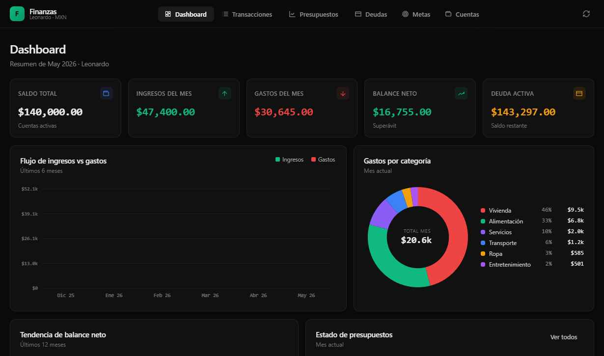
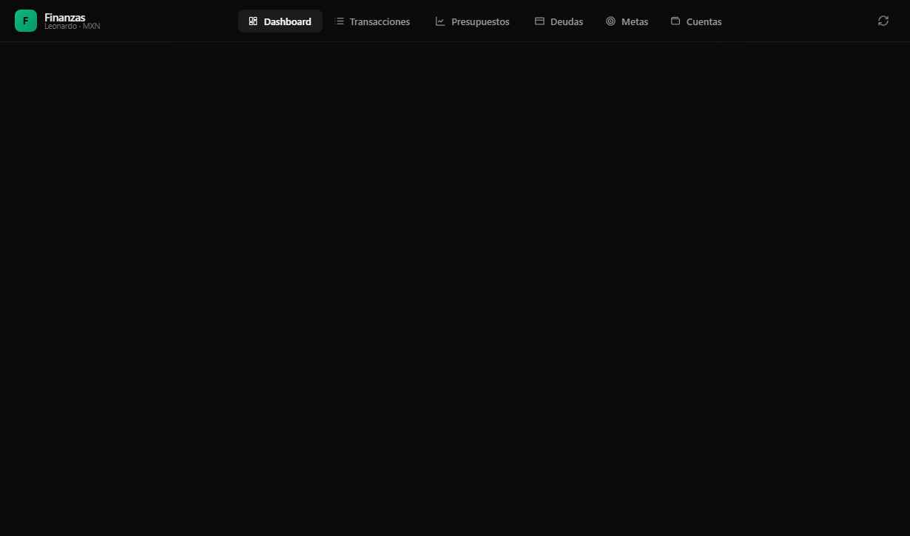

# FinanzasOS

App web de finanzas personales — dashboard analítico con gráficas, presupuestos mensuales, seguimiento de deudas y metas de ahorro. Corre 100% local, sin dependencias externas, con persistencia en archivo JSON.



## Características

- **Dashboard** — KPIs en tiempo real, flujo ingresos/gastos de los últimos 6 meses, gastos por categoría (donut chart), tendencia de balance (12 meses), estado de presupuestos y alertas automáticas
- **Transacciones** — tabla con filtros por mes, tipo y categoría; formulario rápido para agregar ingresos y gastos
- **Presupuestos** — por mes y año; barra de progreso con estado automático (OK / Precaución / Límite / Excedido) calculado contra las transacciones del mes
- **Deudas** — seguimiento de pagos, porcentaje pagado, saldo restante y fecha límite
- **Metas** — progreso visual en anillo, monto faltante y días restantes a la fecha objetivo
- **Cuentas** — saldo por cuenta, toggle activa/inactiva
- Tema oscuro estilo fintech · moneda MXN · responsive (móvil/tablet)

## Stack

| Capa | Tecnología |
|------|-----------|
| Frontend | React 18 (CDN) + Babel Standalone + JSX |
| Estilos | CSS custom (tema oscuro, variables CSS) |
| Gráficas | SVG nativo (sin librerías) |
| Backend | Python `http.server` (stdlib — sin instalar nada) |
| Base de datos | `finanzas_data.json` (archivo local) |

> No requiere Node.js ni npm. Solo Python 3.8+.

## Requisitos

- Python 3.8 o superior (verificar: `python --version`)
- Navegador moderno (Chrome, Edge, Firefox)
- Conexión a internet solo para cargar las fuentes (Google Fonts) — la app funciona offline si ya cargaste una vez

## Instalación

```bash
git clone https://github.com/leonardorodriguez-hixsa/finanzas-web.git
cd finanzas-web
```

No hay dependencias que instalar.

## Uso

### Windows — doble clic
```
start.bat
```

### Cualquier sistema operativo
```bash
python server.py
```

Abre automáticamente `http://localhost:8765` en tu navegador.

**Para cerrarlo:** `Ctrl+C` en la terminal (o cierra la ventana del servidor).

## Primera vez

Al abrir la app por primera vez (sin `finanzas_data.json`), se cargan **datos de ejemplo** para que puedas explorar todas las funciones sin ingresar nada. Los cambios que hagas se guardan automáticamente.

Para empezar desde cero con tus datos reales, usa el botón **Reset** en la app (ícono de recarga en la esquina superior derecha) o borra `finanzas_data.json`.

## Cómo funcionan los datos

Cada vez que guardas un registro, la app:
1. Actualiza `localStorage` del navegador (acceso instantáneo)
2. Hace un `POST /api/db` al servidor local → escribe `finanzas_data.json`

Al cargar la app, primero lee del servidor (fuente de verdad), luego localStorage como respaldo.

**Backup:** copia `finanzas_data.json` a donde quieras.

## Importar desde SQLite

Si tienes datos en una base SQLite con el esquema del agente de finanzas:

```bash
python importar_datos.py
```

Lee `../finanzas-personal/finanzas.db` y genera `finanzas_data.json` con tus datos reales.

## Estructura del proyecto

```
finanzas-web/
├── Finanzas.html           # App principal (entry point)
├── data.js                 # Store global + persistencia (localStorage + servidor)
├── app.jsx                 # Layout, navegación, router
├── charts.jsx              # Gráficas SVG (barras, donut, línea, anillo)
├── components.jsx          # Componentes compartidos (modals, badges, toasts)
├── util.jsx                # Formatters, helpers
├── page-dashboard.jsx      # Página Dashboard
├── page-transacciones.jsx  # Página Transacciones
├── page-presupuestos.jsx   # Página Presupuestos
├── page-deudas.jsx         # Página Deudas
├── page-metas.jsx          # Página Metas
├── page-cuentas.jsx        # Página Cuentas
├── tweaks-panel.jsx        # Panel de ajustes visuales
├── server.py               # Servidor HTTP local + API /api/db
├── importar_datos.py       # Migración desde SQLite
├── start.bat               # Lanzador Windows (doble clic)
└── finanzas_data.json      # Base de datos local (generado en uso)
```

## Capturas

| Dashboard | Transacciones |
|-----------|--------------|
|  |  |

| Presupuestos | Deudas |
|-------------|--------|
|  |  |

## Acceso desde celular / tablet

Si tu PC y teléfono están en la misma red WiFi, abre en el celular:

```
http://<IP-de-tu-PC>:8765
```

Tu IP local: `ipconfig` en Windows → busca "Dirección IPv4".

## Licencia

Uso personal. Sin garantías.
